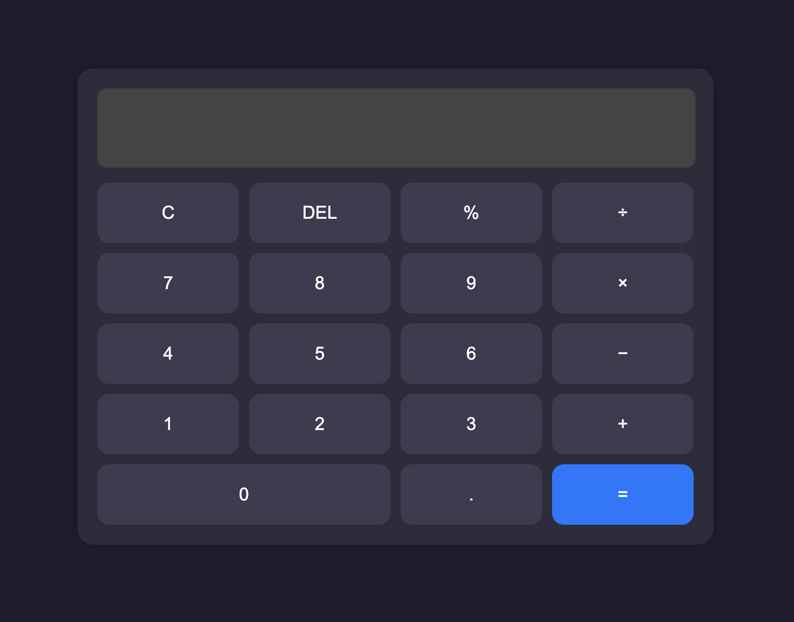

# 🧮 Simple Calculator

A clean and responsive web-based calculator built using **HTML**, **CSS**, and **JavaScript**. It supports mouse and keyboard input, and even has a custom favicon!

---

## 🚀 Features

- Basic arithmetic operations (Add, Subtract, Multiply, Divide)
- Keyboard support for input (numbers and operations)
- `Shift + Delete` clears the display
- Responsive design (looks neat on desktop & mobile)
- Custom favicon for branding 🔥

---

## 🖼️ Preview

> Add a screenshot of your calculator here by saving it as `screenshot.png` in your repo.

---

## 🛠️ Tech Stack

- HTML5
- CSS3
- JavaScript (Vanilla JS, no frameworks)

---

## 🧑‍💻 How to Use

1. Clone or download this repository.
2. Open `index.html` in your browser.
3. Start calculating! You can click buttons or use your keyboard.

---

## ⌨️ Keyboard Shortcuts

| Key                 | Action           |
|---------------------|------------------|
| Numbers (0–9)       | Input number     |
| `+ - * /`           | Math operations  |
| `Enter` or `=`      | Calculate        |
| `Backspace`         | Delete last digit|
| `Shift + Delete`    | Clear all input  |

---

## 🖼️ Customize It

- You can change the favicon by replacing `favicon.png` in the root directory.
- Edit the styles in `style.css` to give it a new theme.
- Add more features like history, dark mode, or scientific mode!

---

## 📦 File Structure

